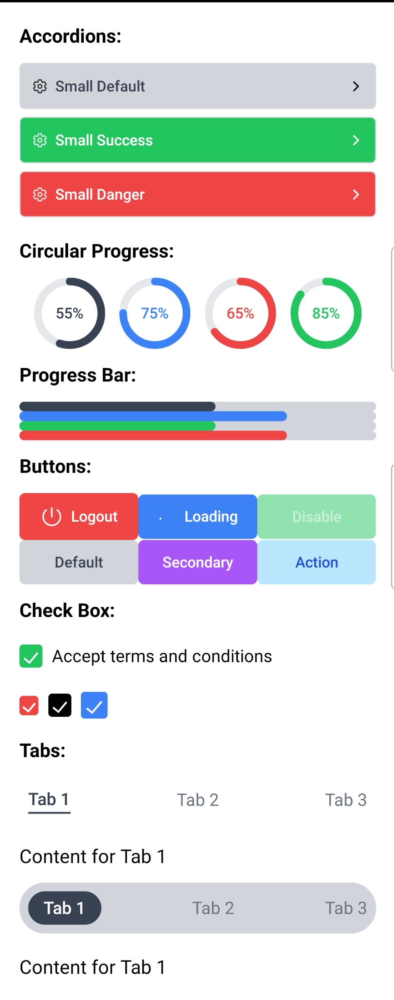
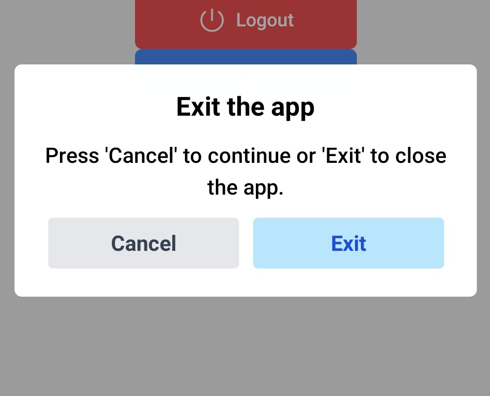
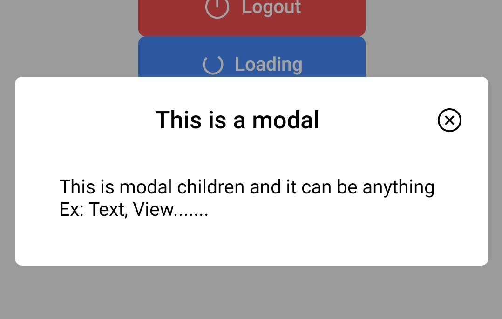

# halka-ui-native

A collection of customizable React Native components using **Tailwind CSS** and **React Native Reanimated**.  
This package includes a **Button, Accordion, Progress Bar, and Circular Progress**. More Halka components will be added in a timely.

## ⚠️ Important

Please configure Nativewind and Tailwind CSS before installing the package; otherwise, the package won't work.

## 🚀 Installation

First, install the package via npm or yarn:

```sh
npm install halka-ui-native
# or
yarn add halka-ui-native

```

## 🚀 Dependencies

This package requires:

```sh
react (>= 18.0.0)
react-native (>= 0.70.0)
react-native-reanimated (>=3.0.0)
react-native-svg (>=15.0.0)
nativewind (>= 2.0.11)
tailwindcss (~3.0.0)
```

## ⚙️ Settings

You must configure your `tailwind.config.js` file to use the `brand` variant.

```js
/** @type {import('tailwindcss').Config} */
module.exports = {
  content: ["./app/**/*.{js,jsx}"],
  theme: {
    extend: {
      colors: {
        brand: "#C03221", // put your brand color code here.
      },
    },
  },
  plugins: [],
};
```

## 📌 Usage

Importing Components
Once installed, you can easily import and use the components in your project.

```jsx
import React from "react";
import { View } from "react-native";
import {
  Button,
  Accordion,
  ProgressBar,
  CircularProgress,
} from "halka-ui-native";

const App = () => {
  return (
    <View className="flex-1 items-center justify-center">
      <Button />
      <Accordion />
      <ProgressBar />
      <CircularProgress />
    </View>
  );
};

export default App;
```

## 📌 Screenshots

<table>
  <tr>
    <td></td>
    <td></td>
    <td></td>
  </tr>
</table>

## Accordion Props

| Prop         | Type        | Default                                                                                      | Possible Values                                                                             |
| ------------ | ----------- | -------------------------------------------------------------------------------------------- | ------------------------------------------------------------------------------------------- |
| `title`      | `string`    | `"Button"`                                                                                   | Any string                                                                                  |
| `size`       | `string`    | `medium`                                                                                     | `small`, `medium`, `large`                                                                  |
| `variant`    | `string`    | `default`                                                                                    | `default`, `brand`, `primary`, `secondary`, `danger`, `success`, `warn`, `cancel`, `action` |
| `children`   | `ReactNode` | `<Text className="p-4">This accordion children can be anything Ex: Text, View.......</Text>` | Any React Native elements (`View`, `Text` ect)                                              |
| `titleIcon`  | `ReactNode` | `null`                                                                                       | Recommended `react-native-vector-icons` <br />`<Icon name="settings-outline" />`            |
| `expandIcon` | `ReactNode` | `null`                                                                                       | Recommended `react-native-vector-icons` <br />`<Icon name="settings-outline" />`            |

### Usage

```jsx
import Icon from "react-native-vector-icons/IonIcons";

<Accordion
  size="medium"
  variant="brand"
  text="Settings"
  titleIcon={<Icon name="settings-outline" />}
  expandIcon={<Icon name="chevron-right" />}
/>;
```

## Button Props

| Prop       | Type        | Default    | Possible Values                                                                             |
| ---------- | ----------- | ---------- | ------------------------------------------------------------------------------------------- |
| `size`     | `string`    | `medium`   | `small`, `medium`, `large`                                                                  |
| `variant`  | `string`    | `default`  | `default`, `brand`, `primary`, `secondary`, `danger`, `success`, `warn`, `cancel`, `action` |
| `disabled` | `boolean`   | `false`    | `true`, `false`                                                                             |
| `loading`  | `boolean`   | `false`    | `true`, `false`                                                                             |
| `text`     | `string`    | `"Button"` | Any string                                                                                  |
| `onPress`  | `function`  | `null`     | Function callback                                                                           |
| `icon`     | `ReactNode` | `null`     | Recommended `react-native-vector-icons` <br />`<Icon name="check-circle" />`                |

### Usage

```jsx
import Icon from "react-native-vector-icons/IonIcons";

<Button
  size="medium"
  variant="brand"
  text="Click Me"
  icon={<Icon name="check" />}
/>;
```

## Checkbox Props

| Prop       | Type       | Default   | Possible Values                                                         |
| ---------- | ---------- | --------- | ----------------------------------------------------------------------- |
| `label`    | `string`   | `''`      | Any string                                                              |
| `checked`  | `boolean`  | `false`   | `true`, `false`                                                         |
| `disabled` | `boolean`  | `false`   | `true`, `false`                                                         |
| `onChange` | `function` | `null`    | Function callback                                                       |
| `size`     | `string`   | `medium`  | `small`, `medium`, `large`                                              |
| `variant`  | `string`   | `default` | `default`, `brand`, `primary`, `secondary`, `danger`, `success`, `warn` |

### Usage

```jsx
const [isChecked, setIsChecked] = useState(true);

<View className="checkbox flex-row mt-5">
  <CheckBox
    size="small"
    variant="danger"
    checked={isChecked}
    onChange={setIsChecked}
  />
  <CheckBox checked={isChecked} onChange={setIsChecked} />
  <CheckBox
    size="large"
    variant="primary"
    checked={isChecked}
    onChange={setIsChecked}
  />
</View>
```

## Circular Progress Props

| Prop       | Type     | Default   | Possible Values                                                                             |
| ---------- | -------- | --------- | ------------------------------------------------------------------------------------------- |
| `size`     | `string` | `medium`  | `small`, `medium`, `large`                                                                  |
| `variant`  | `string` | `default` | `default`, `brand`, `primary`, `secondary`, `danger`, `success`, `warn`, `cancel`, `action` |
| `progress` | `number` | `55`      | Any number                                                                                  |
| `duration` | `number` | `1000`    | Any number >=500                                                                            |

### Usage

```jsx
<CircularProgress size="medium" variant="success" progress={75} />
```

## Dialog Props

| Prop                                | Type        | Default               | Possible Values                                |
| ----------------------------------- | ----------- | --------------------- | ---------------------------------------------- |
| `isOpen`                            | `boolean`   | `false`               | `true`, `false`                                |
| `header`                            | `string`    | `'Dialog Header'`     | Any string                                     |
| `subHeader`                         | `string`    | `Empty`               | Any string                                     |
| `onClose`, `onPress`                | `function`  | `null`                | Function callback                              |
| `leftButtonText`, `rightButtonText` | `string`    | `"Cancel"`,`"Submit"` | Any string                                     |
| `children`                          | `ReactNode` | `null`                | Any React Native elements (`View`, `Text` ect) |

### Usage

```jsx
<Dialog
  isOpen={dialogVisible}
  modalHeader="Exit the app"
  modalSubHeader="Press 'Cancel' to continue or 'Exit' to close the app."
  onClose={() => setDialogVisible(false)}
  onSubmit={() => BackHandler.exitApp()}
  leftButtonText="cancel"
  rightButtonText="exit"
/>
```

## Modal Props

| Prop              | Type        | Default           | Possible Values                                                              |
| ----------------- | ----------- | ----------------- | ---------------------------------------------------------------------------- |
| `isOpen`          | `boolean`   | `false`           | `true`, `false`                                                              |
| `header`          | `string`    | `'Dialog Header'` | Any string                                                                   |
| `onPress`         | `function`  | `null`            | Function callback                                                            |
| `showCloseButton` | `boolean`   | `true`            | Any string                                                                   |
| `closeIcon`       | `ReactNode` | `null`            | Recommended `react-native-vector-icons` <br />`<Icon name="close-circle" />` |
| `children`        | `ReactNode` | `null`            | Any React Native elements (`View`, `Text` ect)                               |

### Usage

```jsx
<Modal
  isOpen={modalVisible}
  modalHeader="This is a modal"
  onPress={() => setModalVisible(false)}
>
  <View className="flex-1 items-center justify-center">
    <Text>Modal content will be here.</Text>
  </View>
</Modal>
```

## Progress Bar Props

| Prop       | Type     | Default   | Possible Values                                                         |
| ---------- | -------- | --------- | ----------------------------------------------------------------------- |
| `size`     | `string` | `medium`  | `small`, `medium`, `large`                                              |
| `variant`  | `string` | `default` | `default`, `brand`, `primary`, `secondary`, `danger`, `success`, `warn` |
| `progress` | `number` | `55`      | Any number                                                              |
| `duration` | `number` | `1000`    | Any number >=500                                                        |
| `edge`     | `string` | `rounded` | `square`, `medium`, `rounded`                                           |

### Usage

```jsx
<ProgressBar size="medium" variant="success" progress={75} />
```

## Tabs Props

| Prop       | Type     | Default   | Possible Values                                                         |
| ---------- | -------- | --------- | ----------------------------------------------------------------------- |
| `tabs`     | `array`  | `null`    | `[{title: '', content: <ReactNode /> }]`                                |
| `tabTheme` | `string` | `classic` | `classic`, `modern`                                                     |
| `size`     | `string` | `medium`  | `small`, `medium`, `large`                                              |
| `variant`  | `string` | `default` | `default`, `brand`, `primary`, `secondary`, `danger`, `success`, `warn` |

### Usage

```jsx
  const tabs = [
    {
      title: 'Tab 1',
      content: (
        <View className="mt-5">
          <Text className="text-lg">Content for Tab 1</Text>
        </View>
      ),
    },
    {
      title: 'Tab 2',
      content: (
        <View className="mt-5">
          <Text className="text-lg">Content for Tab 2</Text>
        </View>
      ),
    },
    {
      title: 'Tab 3',
      content: (
        <View className="mt-5">
          <Text className="text-lg">Content for Tab 3</Text>
        </View>
      ),
    },
  ];
  <Tab tabs={tabs} />
  <Tab tabs={tabs} tabTheme="modern" />
```
